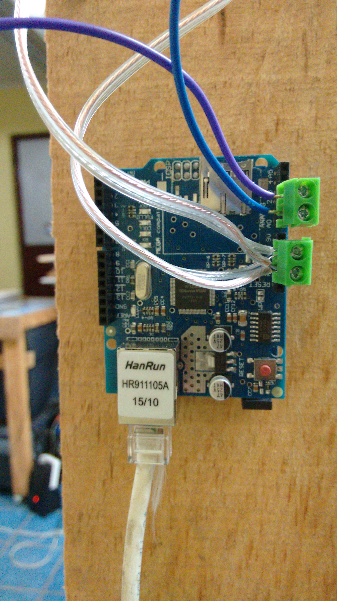
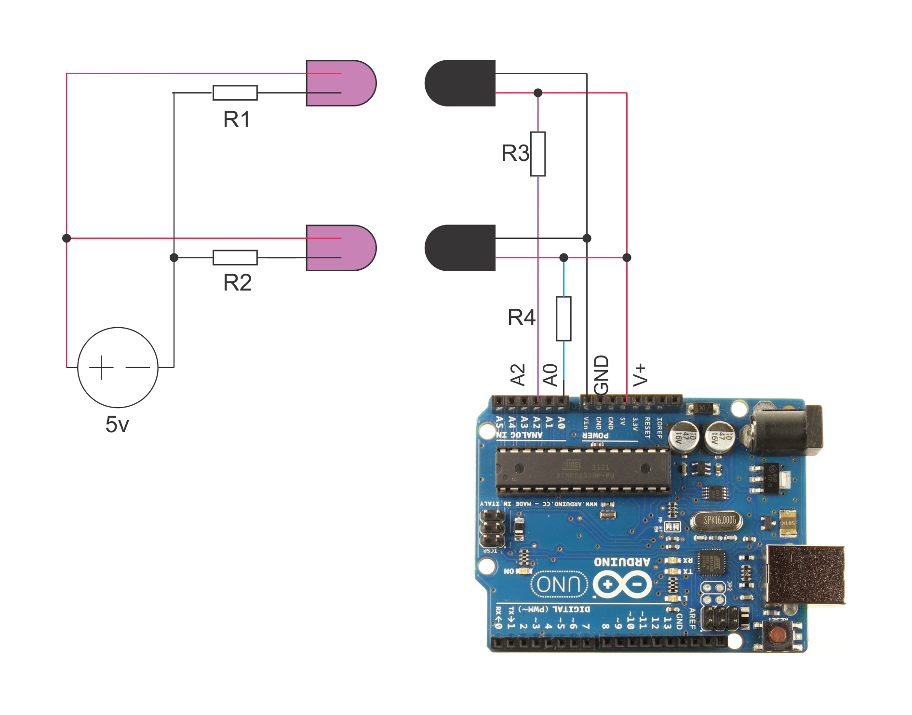

Arduino
===================================

Las puertas sensadas fueron conectadas a internet a través de tarjetas Arduino.

Para el montaje de las puertas se utilizó:

* 2 Arduinos UNO
* 2 Wiznet Ethernet shield
* 4 Leds infrarrojos
* 4 FotoTransistores
* 4 Resistencias 220
* 4 Resistencias 2.2K
* 4 terminales de 2 entradas
* 1 Fuente DC a 5V
* 2 m cable cal22
* 2 Duelas 3x1pulg
* 2 Duelas 2x1pulg
* 16 pijas 1 1/2 pulg

Imágenes
------------------------------------

