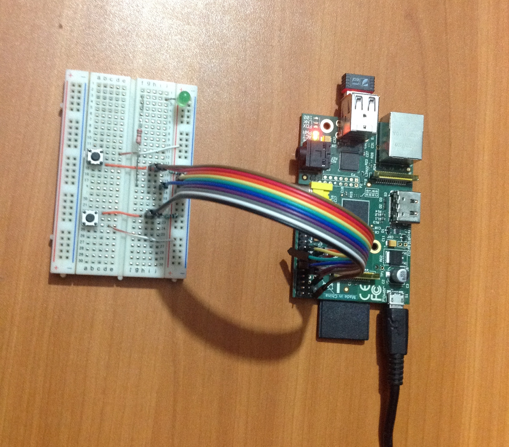

Raspberry Pi B+
==============================================


Instalar el programa
----------------------------------------------

```
$ sudo aptitude install python-pip
$ sudo pip install requests
$ wget https://raw.githubusercontent.com/Ligator/PeopleCounter-Devices/master/PeopleCounter%20for%20RPi/PeopleCounterRPi.py
$ sudo nano /etc/profile
```

Agregar al final del archivo:

```
$ sudo python /home/pi/PeopleCounterRPi.py
```

Luego:
`Ctrl+X`, `Y` y `Enter` para guardar y salir.


Ejecutar el programa al arrancar
-----------------------------------------------

### Autologin
Configurar el autologin para que se salte el menú `raspi-config` al arrancar.

```
sudo nano /etc/inittab
```

Borrar (o comentar) esta línea:

```
1:2345:respawn:/sbin/getty 115200 tty1
```

Y agregar ésta otra:

```
1:2345:respawn:/bin/login -f pi tty1 </dev/tty1 >/dev/tty1 2>&1
```

Luego:
`Ctrl+X`, `Y` y `Enter` para guardar y salir.

### Iniciar programa cuando la RPi arranque.

```
sudo nano /etc/profile
```

Agregar al final del archivo la sig. línea:

```
sudo python /home/pi/PeopleCounterRPi.py
```

Luego:
`Ctrl+X`, `Y` y `Enter` para guardar y salir.

Prueba
----------------------------------------------

```
sudo reboot
```


